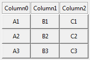
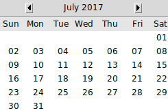
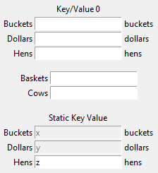
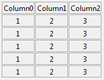
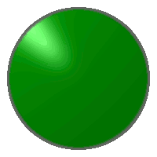
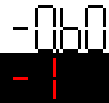
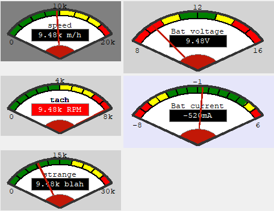
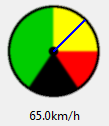

# Purpose

This repository holds useful high-level widgets written in pure python.  
This library used type hints and requires Python 3.5+; it could, however, be back-ported to earlier Python versions without difficulty.

Here are some examples screenshots of the widgets you can create:

#### Button-Grid:  

#### Byte-Label:  

#### Calendar:  

#### Dropdown:  

#### Entry-Grid:  

#### Multi-Slot Frame

#### Graph:  

#### Key-Value:  

#### Label-Grid:  

#### LED: (size can be scaled)  

#### SevenSegment and SevenSegmentDisplay

#### Gauge

#### Rotary-Scale: (Tachymeter)    

For more details, check out the [documentation](https://tk-tools.readthedocs.io).

# Testing

Basic testing has been instantiated *however* it is currently limited.  To execute style testing:

    flake8 tk_tools
    
To execute automated tests:

    py.test test.py
    
At the time of this writing, only 49% of lines are covered.  More testing will be
added to new widgets as they are brought online while further testing will be added
to old widgets as the project matures.

# Contributions

Contributions for new widgets, documentation, tests, and resolving issues are welcomed.

Contribution guidelines:

1. Fork the repository to your account.
2. Clone your account repository to your local development environment.
3. Create/checkout a new branch appropriately named by feature, bug, issue number, whatever.
4. Make your changes on your branch. The ideal changes would:

 - have working examples in the examples directory
 - have documentation in the docs directory

5. Push your changes to your github account.
6. Create a pull request from within github.

All code is to be passing `flake8` before it is merged into master!
